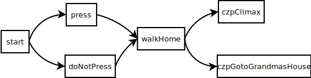

# 3. Section
## 3.1 概述
每个 WTCD 文档都是由若干个 Section 组成的。本章节将会介绍如何定义 section 和互相连接 section。

每一个 Section 都由一个**逻辑块**和任意自然数个**内容块**组成。

比如说，在上一章节给出的例子里就有以下 Sections：

- `start`
- `press`
- `doNotPress`
- `walkHome`
- `czpClimax`
- `czpGotoGrandmasHouse`

这些 Sections 被连接在一起形成如下结构：



## 3.2 Section 逻辑
若要创建一个 Section，**逻辑块**是必不可少的。**逻辑块**决定了当运行到这个 Sections 时在输出正文内容前和输出正文内容后需要做什么。所有的**逻辑块**定义都必须在所有**内容块**之前。

### 3.2.1 逻辑块的基本结构
Section 的定义使用如下结构：

```wtcd
section <Section 名字> [先行表达式] then <后发表达式>
```

举个例子，给出如下定义：

```wtcd
section example {
  a += 1
} then {
  a += 2
}
```

其中 Section 名字是 `example`。其先行表达式为 `{ a += 1 }`，后发表达式为 `{ a += 2 }`。也就是说，当需要进入 `example` 这个 section 时，WTCD 解释器会:

1. 对 `{ a += 1 }` 求值。这个过程会让变量 a 的值加 1。
2. 根据**内容块**的定义输出。（见 3.3）
3. 对 `{ a += 2 }` 求值。这个过程会让变量 a 的值加 2。
4. 根据 `{ a += 2 }` 的返回结果决定接下来怎么做。但是因为 `{ a += 2 }` 没有指定返回值，那么就会采用默认返回值 `null`。在这里，若后发表达式返回值为 `null`，WTCD 就会什么也不做，如果此时 Section 栈（见 3.2.3）为空的话，就会结束运行。

先行表达式是可选的，如果不提供先行表达式，那么就意味着在需要执行先行表达式的时候，什么也不做。

### 3.2.2 逻辑块的互相连接
WTCD 永远从第一个定义的 Section 开始运行。

WTCD 会根据每一个逻辑块的后发表达式运算结果来决定需要做什么。后发表达式的返回值必须是 `action` 或者 `null`（见 3.2.2.2.2）。如果类型是 `action`，那么这个 `action` 就会被执行。如果是 `null`，则会什么也不做。

`action` 目前一共有 3 种：`exit`，`goto`，和 `selection`。下面来逐一介绍。

#### 3.2.2.1 Exit
因为 `exit` 比较简单，那么先介绍 `exit`。

`exit` 被执行时，会立刻终止 WTCD 的运行。举个例子：

```wtcd
section test then exit
```

在这个例子中，无论因为什么原因进入 `section test` 以后，WTCD 都会停止运行。

#### 3.2.2.2 Goto
通常来说 `goto` 也不复杂。因为当 `goto` 后面提供一个 Section 名的时候，执行 `goto` 的作用基本就是跳转到指定的 section：

```wtcd
section a then goto b
section b then exit
```

在这个例子中，当进入并执行 `section a` 之后，WTCD 会自动跳转到 `section b`。因为 `section b` 的 `then` 后面跟的是 `exit`，所以 `section b` 执行后就会停止运行。

然而，复杂的是，`goto` 允许在后面提供多个 Section。`goto` 严格来说应该被理解为“将这些 Sections 以相反顺序入栈”。或者换句话说：“依次执行这几个 Section”。现在举个提供多个 Section 的 `goto` 的例子：

```wtcd
section main then goto [ a1 b1 ]

section a1 then goto a2
section a2 then null

section b1 then goto b2
section b2 then null
```

[执行效果](./例子/Goto-入栈.html)

首先需要先了解，如果 `then` 之后的表达式返回的是 `null`，那么就代表什么也不做。

在上述例子中，可以看到各个 Section 的执行顺序为：`main -> a1 -> a2 -> b1 -> b2`。下面给出原因：

1. WTCD 从第一个 Section 开始运行，所以执行 `main`。
2. `main` 的后发表达式返回 `goto [ a1 b1 ]`，所以入栈 `b1` 和 `a1`。此时栈的状态为：`[ b1 a1 ]`。
3. 从栈中取出最后一项，是 `a1`，因此运行 `a1`。此时栈的状态为：`[ b1 ]`。
4. `a1` 的返回值是 `goto a2`，因此入栈 `a2`。此时栈的状态为：`[ b1 a2 ]`。
5. 从栈中取出最后一项，是 `a2`，因此运行 `a2`。此时栈的状态为：`[ b1 ]`。
6. `a2` 的返回值是 `null`，因此什么也不做。此时栈的状态为：`[ b1 ]`。
7. 从栈中取出最后一项，是 `b1`，因此运行 `b1`。此时栈的状态为：`[ ]`。
8. `b1` 的返回值是 `goto b2`，因此入栈 `b2`。此时栈的状态为：`[ b2 ]`。
9. 从栈中取出最后一项，是 `b2`，因此运行 `b2`。此时栈的状态为：`[ ]`。
10. `b2` 的返回值是 `null`，因此什么也不做。此时栈的状态为：`[ ]`。
11. 栈空，停止运行。

或者，另一个解释方式是，`goto` 在 WTCD 里相当于是“函数调用”。`goto a1` 相当于是调用“函数” `a1`。然而，由于所有的 `goto` 都会在 Section 的最后执行，因此 WTCD 可以在入栈目标函数前出栈，相当于是强制进行了尾递归优化。

如果还是不能理解，这边有一个 JavaScript 的类比函数你可以参考下。

```javascript
function main() {
  console.info('main');
  a1();
  b1();
}
function a1() {
  console.info('a1');
  a2();
}
function a2() {
  console.info('a2');
}
function b1() {
  console.info('b1')
  b2();
}
function b2() {
  console.info('b2');
}
main();
```

#### 3.2.2.3 Selection
除了自动执行固定的 Action 外，WTCD 允许在每一个 Section 后暂停运行，并要求由用户做出选择。若要等待用户作出选择，就需要在 `then` 后提供一个 Selection。

##### 3.2.2.3.1 创建 Selection 和 Choice
若要创建一个 Selection，则需要使用 `selection` 关键词和 `choice` 关键词。

其中，`selection` 使用如下格式：

```wtcd
selection <选项列表>
```

`choice` 用于创建一个选项。若要使用则需要使用如下格式：

```wtcd
choice <选项显示文本> <被选择后执行的 Action>
```

例如：

```wtcd
section start then selection [
  choice "去 A" then goto a
  choice "去 B" then goto b
]
section a then exit
section b then exit
```

在上述例子中，WTCD 会先执行 `start`。随后因为 `then` 之后遇到了 `selection`，脚本会停止运行，并输出两个选项供用户选择。若用户选择了“去 A”，则 Action `goto a` 会被执行，因此会跳转到 `section a`。相反，若用户选择了“去 B”，则 Action `goto b` 会被执行，因此会跳转到 `section b`。

##### 3.2.2.3.2 关于使用 `null`
在 Selection 的选项列表里面，可以提供 `null`。所有这些 `null` 都会被忽略。举个例子：

```wtcd
section main then selection [
  null
  choice "A" goto a
  null
  choice "B" goto b
  null
]
```

和

```wtcd
section main then selection [
  choice "A" goto a
  choice "B" goto b
]
```

是等效的。

至于这个特性有什么用，请看 3.2.2.4。

此外，**需要注意区分的是**，每一个 Choice 的 Action 也可以是 `null`。一旦一个 Choice 的 Action 是 `null`，那么这个按钮就是不可选的按钮。请看下述例子：

```wtcd
section main then selection [
  choice "Choice A" goto a
  choice "Choice B" null // 这个按钮连点都点不了
]
```

#### 3.2.2.4 Action 和 Choice 作为值
这里需要注意的是，Action 和 Choice 都是可以存储的值。它们各自的类型分别是：`action` 和 `choice`。

举个例子：

```wtcd
declare [
  // 定义一个存储 Action 的变量 someAction 并初始化为 goto b
  action someAction = goto b

  // 定义一个存储 Choice 的变量 someChoice1，其被选择后使用的 Action 用变量表示
  choice someChoice1 = choice "choice 1" someAction 

  // 定义一个存储字符串的变量 someString
  string someString = "Some text" 

  // 定义一个存储 Choice 的变量 someChoice2，choice 的显示文本使用一个涉及之前定义的字符串变量的表达式
  choice someChoice2 = choice someString + " wow!" exit

  // 定义一个存储 Selection 的变量 someSelection，它的选项由之前的变量定义
  action someSelection = selection [ someChoice1 someChoice2 ]
]

// 定义一个 section 的 then 使用变量 someSelection
section main then someSelection
```

因为其实说到底 `action`，`choice`，或者 `selection` 都只不过是和 `number` 或是 `boolean` 一样的值，所以它们也可以被用在表达式里。

举个例子，你可以使用逻辑选择操作符来选择性隐藏一个选项：

```wtcd
section main then selection [
  condition ? choice "text" goto a : null
]
```

上述例子中，选项“text”只有在 `condition` 为 `true` 的时候才会显示。

同时，你也可以选择性禁用一个选项：

```wtcd
section main then selection [
  choice "text" condition ? goto a : null
]
```

上述例子中，选项“text”都会显示，但是只有在 `condition` 为 `true` 的时候才可以被选择。

## 3.3 Section 内容
定义 Section 的内容相比逻辑而言就简单多了 。Section 的内容由**内容块**定义。所有的**内容块**都必须在所有**逻辑块**以下。

### 3.3.1 基本格式
通常来说，定义一个 Section 的固定输出内容非常简单：

```wtcd
section a then b
section b then exit

---<<< a >>>---
# Title
Hello A

---<<< b >>>---
# Another Title
Hello B
```

可以看到，在 `---<<< a >>>---` 以下，`---<<< b >>>---` 以上的就是运行 `a` 时会输出的内容。同时，在 `---<<< b >>>---` 以下的则是在运行 `b` 时输出的内容。需要注意的是，内容支持 Markdown，因此可以输出粗体，链接，图片等等。

### 3.3.2 多个内容块
其实每个 Section 可以对应零到无数个内容块。每一个内容块可以定义“边界”，即在第几次访问的时候这个内容块可能会出现。

若要定义一个边界，则需要在内容块的 Section 名后写上  `@<边界>`。其中边界可以是：

- 一个数字。例如 `main@3` 代表只有在第三次进入 `main` 时，这个内容块才会被使用。
- 一个数字加短横。例如 `main@3-` 代表只有在第三次及以后进入 `main` 时，这个内容块才会被使用。
- 短横加一个数字。例如 `main@-3` 代表只有在第三次及以前进入 `main` 时，这个内容块才会被使用。
- 一个数字，一个短横，再加一个数字。例如 `main@5-10` 代表只有在第五次到第十次进入 `main` 时，这个内容块才会被使用。

如果符合条件的内容块只有一个，那么这个内容块就会被选择。

如果没有符合条件的内容块，则不会输出任何内容。

如果有超过一个的符合条件的内容块，则会随机选择一个作为输出的内容块。

### 3.3.3 插值
WTCD 的内容块允许插入变量。插入格式为：`<$ 变量名 $>`。比如：

```wtcd
declare number money = 100
section main then exit

---<<< main >>>---
你有 <$ money $> 元钱。
```

需要注意的是，插值仅允许使用全局变量。并不允许使用表达式或者局部变量。
