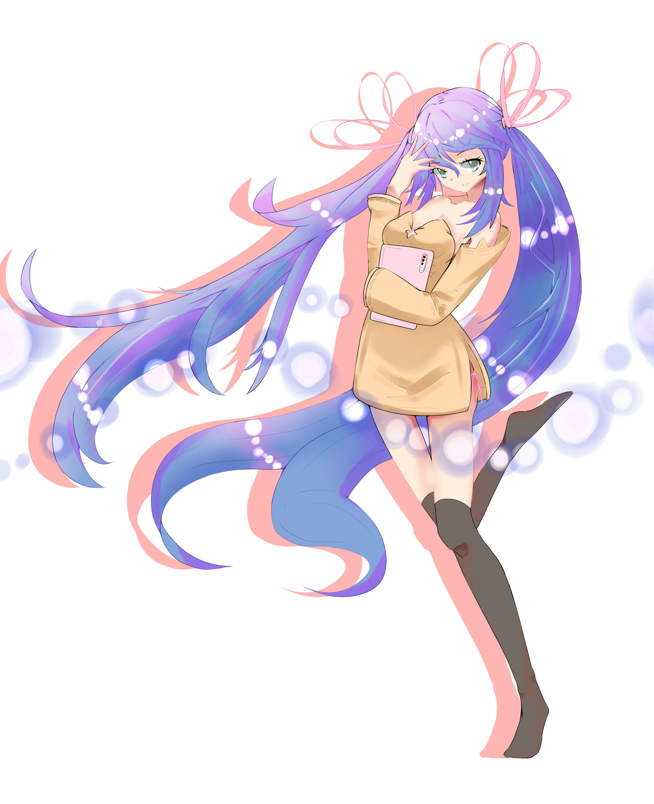

作者：琳 缇佩斯，石倚（画师）

## 晴梦慧
晴梦慧，女，最早出现于第 11 章。她全名苏·晴梦慧。苏是姓，晴梦慧是名。

晴梦慧目前是一名高二学生。性格极度腹黑（这是琳的评价），称呼琳为学姐，称呼按摩棒为仙女棒。晴梦慧穿戴着“Air 型贞操带”。尽管年级比琳要小，她已经可以开车了，不过开的车是和她穿戴的设备有联动就是了。

晴梦慧显然在制作可穿戴科技的组织内有一定的权限。晴梦慧在见到琳后，很快就为后者替换了新的设备，并且取代了 AI。此外，晴梦慧还邀请琳与其一同押送一名“犯人”。

晴梦慧在加入可穿戴科技的组织之前是一个相当正经的人，不知道是把心中压抑的感情释放出来了还是被执行了心理暗示，现在变得有些偏执腹黑了。

> 画师的碎碎念：晴梦慧的形象是三人中我第一个画的，其本人对形象没什么要求让我随意反而让我有点苦恼。几个月不碰画笔之后突然提笔，说实话我还是有点拿不定主意，但是冥冥之中就想把她画得神秘，冰冷而又充满智慧，所以给她设计了蓝色的长发，但是她曾经也是一个温柔，热心又善解人意的大姐姐，所以衣服使用了暖色调。一开始的设计是裸足来的，不过在琳的要求下穿上了过膝袜。光斑一开始是没有的，稍微加上一点发现效果还不错，就多用了点，现在看来有些太多了。
